# drf-cognito-auth
Django REST Framework Sample app by AWS Cognito Auth

Django REST Framework　での　AWS Cognitoを使用した認証API実装のサンプル

## AWS Cognitoの設定

### ユーザープールの作成

1. AWS Cognitoのページにアクセスします。
2. 「ユーザープールの管理」をクリックします。


3. 画面右上の「ユーザープールを作成する」をクリックします。

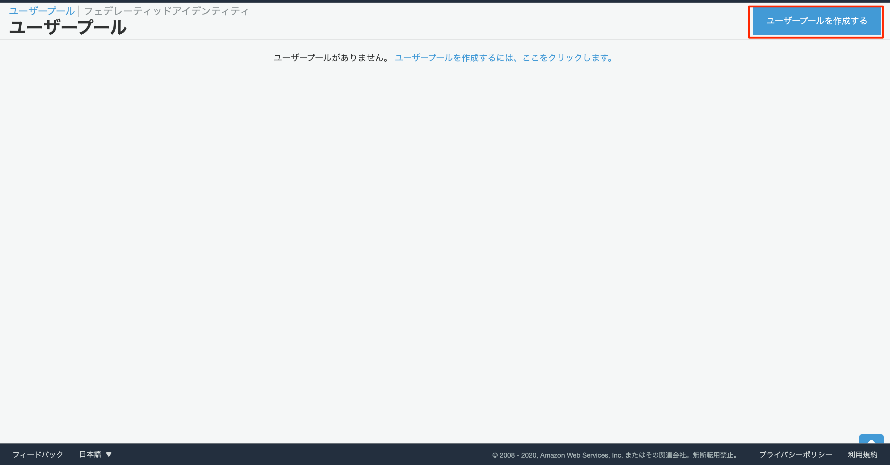

4. プール名に任意のプール名を設定して進みます。

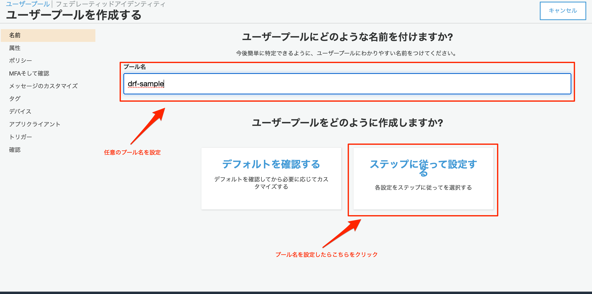

5. 属性の設定をおこないます。このサンプルでは標準属性については全てチェックを外します。

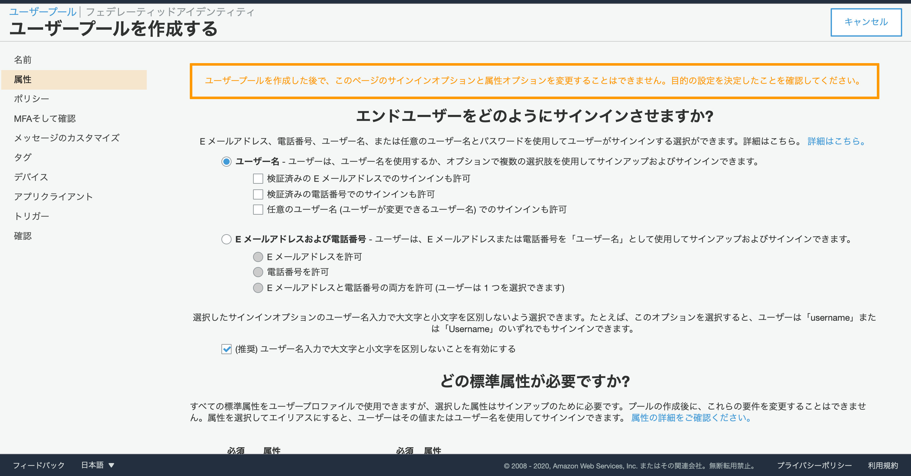
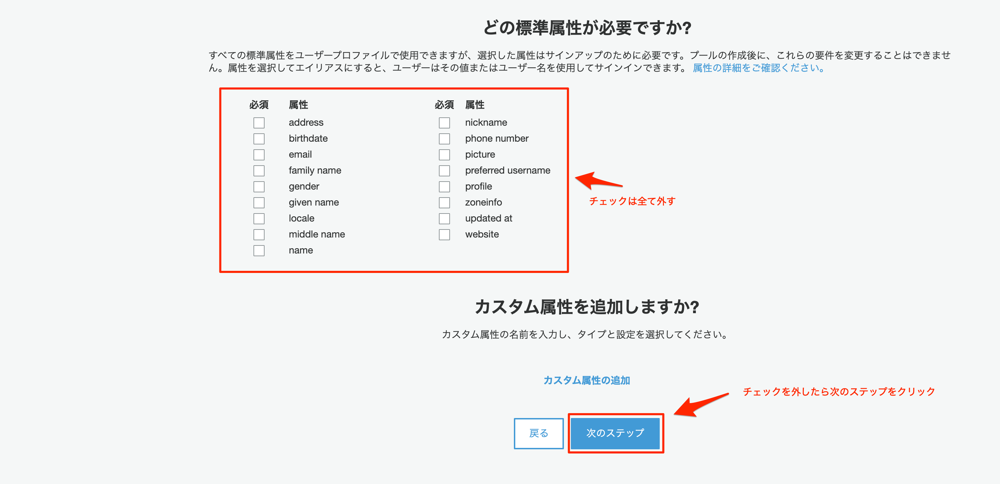

6. ポリシーの設定を行います。パスワードの強度やユーザーに自己サインアップを許可するかなどを設定します。

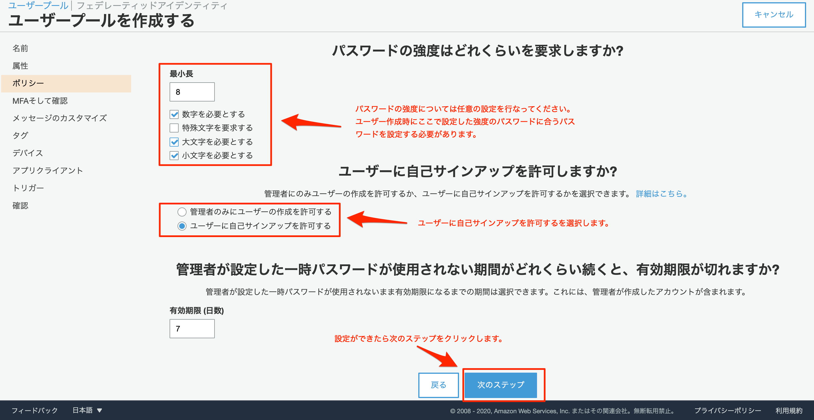

7. MFAそして確認の設定を行います。このサンプルではMFAの設定は行いません。

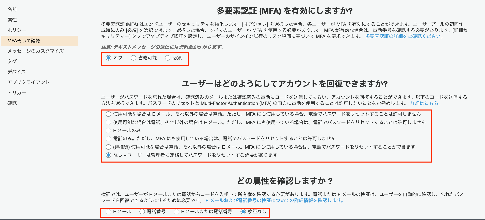

8. 「メッセージのカスタマイズ」、「タグ」、「デバイス」の設定はデフォルトのままで設定します。

9. アプリクライアントの設定

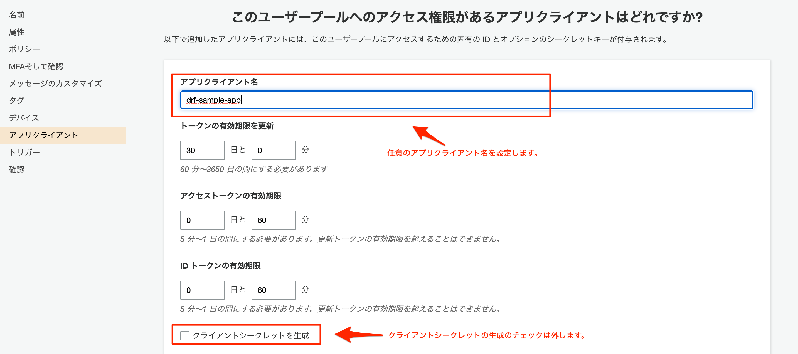
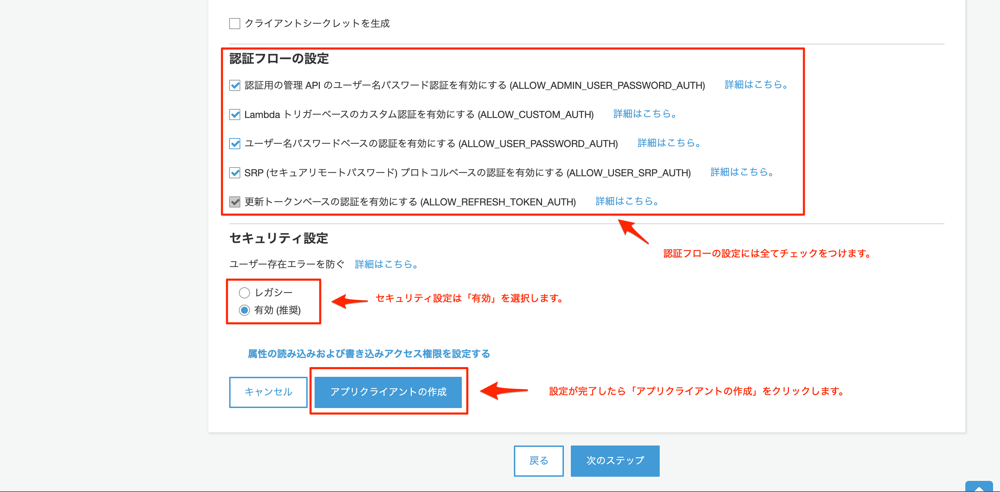

10. トリガーの設定

トリガーの設定では特に設定する項目はありません。デフォルトのままでOKです。

11. プールの作成

上記の設定が完了したら「プールの作成」をクリックしてユーザープールを作成します。

### プールIDの確認

作成したユーザープールが一覧に表示されているので、クリックして確認します。

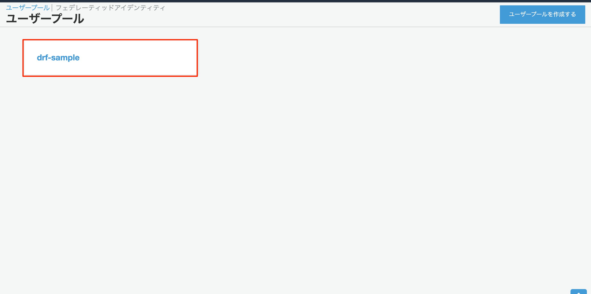

画面上部にプールIDが表示されています。

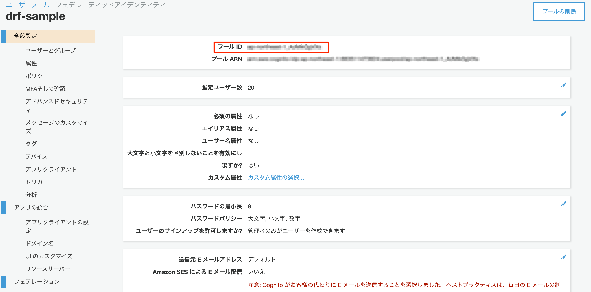

### アプリクライアントIDの確認

画面左側のメニューの「アプリクライアント」をクリックします。
画面真ん中にアプリクライアントIDが表示されています。

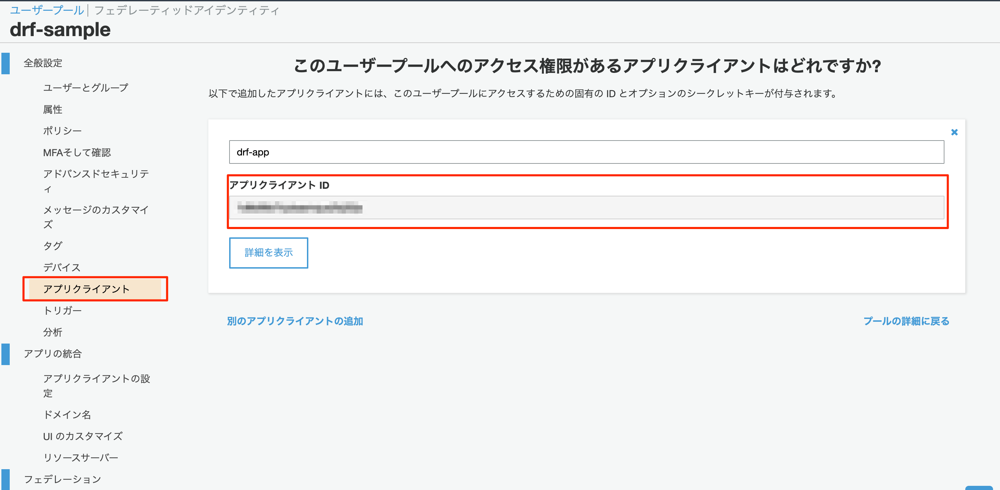

## サンプルプログラムの実行手順

AWS Cognitoの設定を完了していることを前提とする

### 依存ライブラリのインストール

以下のコマンドを実行する

```
pip install -r requirements.txt
```

### .envファイルの編集

.env.sampleの内容を参考に、xxxxxxxxxの部分を自身のアクセスキー及びIDに変更する。
AWS_COGNITO_USER_POOL_IDにはプールID、
AWS_COGNITO_APP_IDにはアプリクライアントID
をそれぞれ設定する。

```
AWS_REGION_NAME=ap-northeast-1
AWS_ACCESS_KEY_ID=XXXXXXXXXXXX
AWS_SECRET_ACCESS_KEY=XXXXXXXXXXXXX
AWS_COGNITO_USER_POOL_ID=ap-northeast-1_XXXXXX
AWS_COGNITO_APP_ID=XXXXXXXXXXXXXX
```

.envファイルを編集したら、export_env.shを実行する

```
sh export_env.sh
```

### マイグレーションの実行

以下のコマンドを実行し、DBのマイグレーションを行う

```
python manage.py migrate
```

### テストコードの実行

以下のコマンドを実行する

```
python manage.py test acount
```