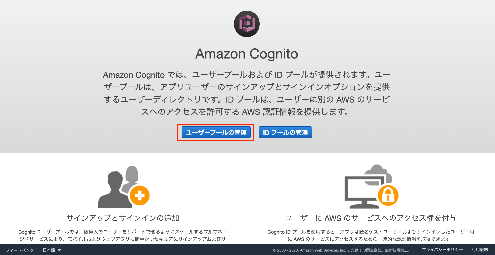

# drf-cognito-auth
Django REST Framework Sample app by AWS Cognito Auth

Django REST Framework　での　AWS Cognitoを使用した認証API実装のサンプル

## AWS Cognitoの設定

### ユーザープールの作成

1. AWS Cognitoのページにアクセスします。
2. 「ユーザープールの管理」をクリックします。



## サンプルプログラムの実行手順

AWS Cognitoの設定を完了していることを前提とする

### 依存ライブラリのインストール

以下のコマンドを実行する

```
pip install -r requirements.txt
```

### .envファイルの編集

.env.sampleの内容を参考に、xxxxxxxxxの部分を自身のアクセスキー及びIDに変更する

```
AWS_REGION_NAME=ap-northeast-1
AWS_ACCESS_KEY_ID=XXXXXXXXXXXX
AWS_SECRET_ACCESS_KEY=XXXXXXXXXXXXX
AWS_COGNITO_USER_POOL_ID=ap-northeast-1_XXXXXX
AWS_COGNITO_APP_ID=XXXXXXXXXXXXXX
```

.envファイルを編集したら、export_env.shを実行する

```
sh export_env.sh
```

### マイグレーションの実行

以下のコマンドを実行し、DBのマイグレーションを行う

```
python manage.py migrate
```

### テストコードの実行

以下のコマンドを実行する

```
python manage.py test acount
```